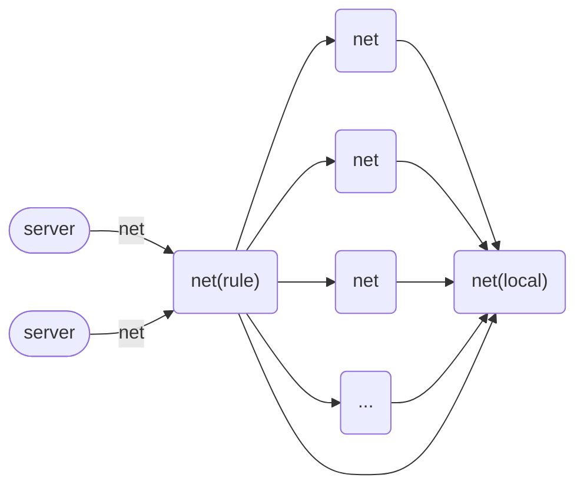

# 配置

Rabbit Digger 支持任意个数的 `server` 和 `net`.

`net` 代表着一种虚拟的网络. 它可以是本地网络, 也可以通过代理提供的网络. 甚至连规则也是一种 `net`.

每个 `net` 都有它的名字和类型. `name` 就是键名, 而 `type` 代表了它的类型.
除了 `local` 类型的 `net` 和一些特殊类型的 `net`, 其他的 `net` 一般都需要基于另一个 `net` 才能生效.

实际上在 `Rabbit Digger Pro` 中大部分代理协议的配置都可以通过添加 `net` 字段来实现链式代理.

`server` 代表着代理服务器. 它可以是一个 `http` 服务器, 也可以是一个 `socks5` 服务器, 大多数情况下你可以使用 `http+socks5` 服务器.

你可以在不同的端口上同时部署多种服务器.

下图是一种典型配置的示意图:

